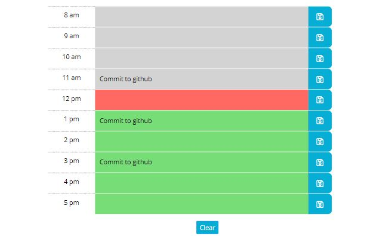

# Work Day Scheduler

## Functions

- The planner has blocks of hours between 8am and 5pm. Which is meant to help organize a work day.
- The blocks change color dependant on the current hour of the day. Grey is for past hours, red is for current hour, and green is for future hours.
- When a task is entered you can press save to push to storage.
- The clear button deletes out the storage and resets the scheduler.

## Construction

For this web application, JQuery, Bootstrap and Moment.js were used. CSS styling was provided for most of the project but minor alterations were made to make the web app more aesthetically pleasing. 

## Screen Shots

